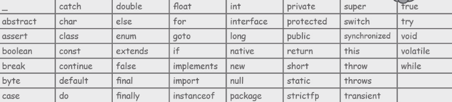

# Head First Java
This is a project based on the O'Reilly book [Head First Java](https://learning.oreilly.com/library/view/head-first-java/9781492091646/),
where I can practice the exercises given within the book to get a better understanding of Java.
---
### Notes
***Class*** - This is a blueprint for which an object is made from. It contains data it knows (**variables**) and
things it does (**methods**).

***Object*** - This is an instance created from a class which can do the things its
class can do, and knows things unique to that particular object.

***Dot Operator*** - This is used to give access to an objects instance variables and methods

***Main Method*** - This is used to start the Java app

```
class Dog {
  int size;        // instance variables
  String breed;    // instance variables
  
  void bark() {    // method
    System.out.println("Woof")
  }
}

class DogTestDrive {
  public static void main (String[] args) {  // main method used to start app
    Dog d = new Dog();   // creates a dog object
    d.size = 40;         // dot operator used to access class variable
    d.bark();            // and call the bark method
  }
}
```

***The Heap*** - This is an area of memory an object goes to when created. When an 
object has no reference, it is eligible for Garbage Collection (GC)

***Java Archive*** - This is a .jar file used to hold all the apps files, it
includes a text file called **manifest** which defines the class containing the main() to run

***Overload Method*** - This is where 2 methods are created with the same name, each
with different arguments in order to differentiate each method

***Enum*** - This is a special class which contain unchangeable variables
```
enum Level {
  LOW,
  MEDIUM,
  HIGH
}

Level myVar = Level.MEDIUM    
System.out.println(myVar)    // returns MEDIUM
```

***Reserved Words***


***Variable Types***

**Primitive** - There are 8 types that all represent the actual value of the variable. Primitives have their 
Object wrapper classes with below examples:
1. boolean e.g. ```boolean correct = true;```
2. char e.g. ```char letter = 'r';```
3. long e.g. ```long num = 20222022274L;```
4. int e.g. ```int year = 2022;```
5. short e.g. ```short temp = -50;```
6. byte e.g. ```byte range = 120;```
7. double e.g. ```double degree = -5.3;```
8. float e.g. ```float degree = -5.3f;```

**Reference** - These contain bits representing a way to get to a specific object, e.g.

```
Dog myDog = new Dog()
```

- All reference variable are the same size on each JVM, regardless of the size of the object they reference

***Strings***

In java, strings are immutable objects as they cannot be changed. 

The same string object can be shared for multiple references which allows for saving of memory. 

A variable which is assigned a new value will create a new object, as the initial 
object cannot be changed. The initial object will then be eligible for GC as it 
doesn't have any reference to anything.
